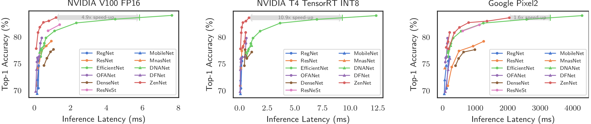

# Welcome to Ming Lin's Homepage

 

I am currently an algorithm engineer at Alibaba Group (U.S.). My current research interest mainly focuses on Neural Architecture Search (NAS) and deep learning theories. Before I joined Alibaba Group (U.S.), I was a Reseach Investigator in the Medical School of Michigan University advised by Dr. Jieping Ye until April 2019. I worked in the School of Computer Science at Carnegie Mellon University from July 2014 to Sep 2015 advised by Dr. Alexander G. Hauptmann. I received my Ph.D. degree in computer science from Tsinghua University in 2014 under the supervision of Prof. Chuangshui Zhang. During my Ph.D. study, I had been a visiting scholar in Michigan State University advised by Prof. Rong Jin from Nov 2012 to Dec 2013 and in CMU from Dec 2013 to July 2014. 

 

Email: [ming.l@alibaba-inc.com](mailto:ming.l@alibaba-inc.com), [linming04@gmail.com](mailto:linming04@gmail.com)

Office: Alibaba Group (U.S). 500 108th Ave NE Suit 800, Bellevue, WA 98004. <a href="https://www.google.com/maps/search/Alibaba,+108th+Avenue+Northeast+%23800,+Bellevue,+WA/@47.6156136,-122.2007005,16z/data=!3m1!4b1"> (Google Map)</a> 

 

## News

**2021-09-01**  Our [Zen-NAS](https://arxiv.org/abs/2102.01063) is accepted by ICCV 2021.

 

## Selected Papers

* Ming Lin, Pichao Wang, Zhenhong Sun, Hesen Chen, Xiuyu Sun, Qi Qian, Hao Li, Rong Jin. **Zen-NAS: A Zero-Shot NAS for High-Performance Deep Image Recognition**. In Proceedings of the 2021 IEEE/CVF International Conference on Computer Vision. ICCV 2021.  [[paper]](to appear) [[arXiv]](https://arxiv.org/abs/2102.01063)  [[bib]](./mybib/zennas_iccv2021.bib)

* Ming Lin, Jieping Ye. **A Non-convex One-Pass Framework for Generalized Factorization Machine and Rank-One Matrix Sensing**. In Proceedings of the 30th Annual Conference on Neural Information Processing Systems (NIPS), Pages 1633-1641, 2016.  [[paper]](https://proceedings.neurips.cc/paper/2016/hash/0a113ef6b61820daa5611c870ed8d5ee-Abstract.html) [[arXiv]](https://arxiv.org/abs/1608.05995v5)  [[bib]](./mybib/NIPS-2016-GFM.bib) [[Github]](https://github.com/MingLin-home/gFM)

* Zhenzhong Lan, Ming Lin, Xuanchong Li, Alexander G. Hauptmann, Bhiksha Raj. **Beyond Gaussian Pyramid: Multi-skip Feature Stacking for Action Recognition**. In Proceedings of the IEEE Conference on Computer Vision and Pattern Recognition (CVPR), Page 204-212, 2015.  [[paper]](https://www.cv-foundation.org/openaccess/content_cvpr_2015/html/Lan_Beyond_Gaussian_Pyramid_2015_CVPR_paper.html) [[arXiv]](https://arxiv.org/abs/1411.6660)  [[bib]](./mybib/Beyond_Gaussian_Pyramid_CVPR_2015.bib)

 

## Projects

### Zen-NAS

Zen-NAS is a lightning fast, training-free Neural Architecture Searching (NAS) algorithm for automatically designing deep neural networks with high prediction accuracy and high inference speed on GPU and mobile device. Using 1 GPU searching for 12 hours, ZenNAS is able to design networks of ImageNet top-1 accuracy comparable to EfficientNet-B5 (~83.6%) while inference speed 4.9x times faster on V100, 10x times faster on NVIDIA T4, 1.6x times faster on Google Pixel2.

Github repository is [here](https://github.com/idstcv/ZenNAS).

### GPU-Efficient Networks

This project aims to develop GPU-Efficient networks via automatic Neural Architecture Search techniques. This project is obsoleted as our ICCV 2021 work [Zen-NAS](https://arxiv.org/abs/2102.01063) is a more powerful tool for designing GPU-efficient networks.

Github repository (**obsoleted**) is [here](https://github.com/idstcv/GPU-Efficient-Networks).

 
 

## Publications

My published papers and pre-prints. [[Jump to my Google Scholar]](https://scholar.google.com/citations?user=08qZeTUAAAAJ#)

### Conference

Ming Lin, Pichao Wang, Zhenhong Sun, Hesen Chen, Xiuyu Sun, Qi Qian, Hao Li, Rong Jin. **Zen-NAS: A Zero-Shot NAS for High-Performance Deep Image Recognition**. In Proceedings of the IEEE/CVF International Conference on Computer Vision (ICCV), 2021.  [[paper]](to appear iccv2021) [[arXiv]](https://arxiv.org/abs/2102.01063)  [[bib]](./mybib/zennas_iccv2021.bib)

Yichen Qian, Zhiyu Tan, Xiuyu Sun, Ming Lin, Dongyang Li, Zhenhong Sun, Li Hao, Rong Jin. Learning Accurate Entropy Model with Global Reference for Image Compression. In Proceedings of the International Conference on Learning Representations (ICLR), 2021. [[paper]](https://openreview.net/forum?id=cTbIjyrUVwJ) [[bib]](./mybib/yichen_entropy_compression_iclr2021.bib)

Ming Lin, Xiaomin Song, Qi Qian, Hao Li, Liang Sun, Shenghuo Zhu, Rong Jin. **Robust Gaussian Process Regression for Real-Time High Precision GPS Signal Enhancement**. In Proceedings of the 25th ACM SIGKDD International Conference on Knowledge Discovery & Data Mining (SIGKDD), 2019. [[paper]](https://dl.acm.org/doi/abs/10.1145/3292500.3330695) [[arXiv]](https://arxiv.org/abs/1906.01095) [[bib]](./mybib/ming_robut_gp_gps_kdd2019.bib)

Hesen Chen, Ming Lin, Xiuyu Sun, Qian Qi, Hao Li, Rong Jin. **MuffNet: Multi-Layer Feature Federation for Mobile Deep Learning**. In Proceedings of the IEEE/CVF International Conference on Computer Vision (ICCV workshop), 2019. [[paper]](https://openaccess.thecvf.com/content_ICCVW_2019/html/CEFRL/Chen_MuffNet_Multi-Layer_Feature_Federation_for_Mobile_Deep_Learning_ICCVW_2019_paper.html) [[bib]](./mybib/muffnet_iccv2019.bib)

Ming Lin, Shuang Qiu, Jieping Ye, Xiaomin Song, Qi Qian, Liang Sun, Shenghuo Zhu, Rong Jin. **Which Factorization Machine Modeling is Better: A Theoretical Answer with Optimal Guarantee**. In Proceedings of the Thirty-Third AAAI Conference on Artificial Intelligence (AAAI), 2019. [[paper]](https://ojs.aaai.org/index.php/AAAI/article/view/4340) [[arXiv]](https://arxiv.org/abs/1901.11149) [[bib]](./mybib/Which-Factorization-Machine-Modeling-Is-Better-A-Theoretical.bib)

Tieliang Gong, Guangtao Wang, Jieping Ye, Zongben Xu, Ming Lin. **Margin Based PU Learning**. In Proceedings of the Thirty-Second AAAI Conference on Artificial Intelligence (AAAI), 2018.  [[paper]](https://ojs.aaai.org/index.php/AAAI/article/view/11698) [[appendix]](./mypdf/Margin_Based_PU_Learning_AAAI_2018_appendix.pdf) [[bib]](./mybib/Margin-Based-PU-Learning.bib)

Xiang Li, Aoxiao Zhong, Ming Lin, Ning Guo, Mu Sun, Arkadiusz Sitek, Jieping Ye, James Thrall, Quanzheng Li. **Self-paced Convolutional Neural Network for Computer Aided Detection in Medical Imaging Analysis**. In Proceedings of the 8th International Workshop on Machine Learning in Medical Imaging (MLMI), 2017.  [[paper]](https://link.springer.com/chapter/10.1007/978-3-319-67389-9_25) [[arXiv]](https://arxiv.org/abs/1707.06145)  [[bib]](./mybib/self-paced-cnn_MLMI2017)

Zhenzhong Lan, Shoou-I Yu, Dezhong Yao, Ming Lin, Bhiksha Raj ; Alexander Hauptmann. **The Best of BothWorlds: Combining Data-Independent and Data-Driven Approaches for Action Recognition**. In Proceedings of the IEEE Conference on Computer Vision and Pattern Recognition Workshops (CVPRW), Pages 1196-1205, 2016.  [[paper]](https://ieeexplore.ieee.org/document/7789642) [[arXiv]](https://arxiv.org/abs/1505.04427)  [[bib]](./mybib/The_Best_of_BothWorlds.bib) [[Github]](https://github.com/idstcv/ZenNAS)

Ming Lin, Jieping Ye. **A Non-convex One-Pass Framework for Generalized Factorization Machine and Rank-One Matrix Sensing**. In Proceedings of the 30th Annual Conference on Neural Information Processing Systems (NIPS), Pages 1633-1641, 2016.  [[paper]](https://proceedings.neurips.cc/paper/2016/hash/0a113ef6b61820daa5611c870ed8d5ee-Abstract.html) [[arXiv]](https://arxiv.org/abs/1608.05995v5)  [[bib]](./mybib/NIPS-2016-GFM.bib) [[Github]](https://github.com/MingLin-home/gFM)

Chuang Gang, Ming Lin, Yi Yang, Gerard de Melo, Alexander G. Hauptmann. **Concepts Not Alone: Exploring Pairwise Relationships for Zero-Shot Video Activity Recognition**. In Proceedings of the 30th AAAI Conference on Artificial Intelligence (AAAI), Pages 3487-3493, 2016.  [[paper]](https://ojs.aaai.org/index.php/AAAI/article/view/10466)  [[bib]](./mybib/Concepts-Not-Alone-Exploring-Pairwise-Relationships-for-Zero.bib)

Chuang Gang, Ming Lin, Yi Yang, Alexander G. Hauptmann. **Exploring Semantic Inter-Class Relationships (SIR) for Zero-Shot Action Recognition**. In Proceedings of the the 29th AAAI Conference on Artificial Intelligence (AAAI), Pages 3769-3775, 2015.  [[paper]](https://ojs.aaai.org/index.php/AAAI/article/view/9800) [[bib]](./mybib/Exploring-Semantic-Inter-Class-Relationships-SIR-for-Zero-Sh.bib)

Zhenzhong Lan, Ming Lin, Xuanchong Li, Alexander G. Hauptmann, Bhiksha Raj. **Beyond Gaussian Pyramid: Multi-skip Feature Stacking for Action Recognition**. In Proceedings of the IEEE Conference on Computer Vision and Pattern Recognition (CVPR), Page 204-212, 2015.  [[paper]](https://www.cv-foundation.org/openaccess/content_cvpr_2015/html/Lan_Beyond_Gaussian_Pyramid_2015_CVPR_paper.html) [[arXiv]](https://arxiv.org/abs/1411.6660)  [[bib]](./mybib/Beyond_Gaussian_Pyramid_CVPR_2015.bib)

Ming Lin, Zhenzhong Lan, Alexander G. Hauptmann. **Density Corrected Sparse Recovery when R.I.P. Condition is Broken**.  In Proceedings of the 24th International Joint Conference on Artificial Intelligence (IJCAI), Pages 3664-3670, 2015.  [[paper]](https://www.ijcai.org/Abstract/15/515) [[bib]](./mybib/Density_Corrected_RIP_IJCAI2015.bib)

Shoou-I Yu, Lu Jiang, Zexi Mao, Xiaojun Chang, Xingzhong Du, Chuang Gan, Zhenzhong Lan, Zhongwen Xu, Xuanchong Li, Yang Cai, Anurag Kumar, Yajie Miao, Lara Martin, Nikolas Wolfe, Shicheng Xu, Huan Li, Ming Lin, Zhigang Ma, Yi Yang, Deyu Meng, Shiguang Shan, Pinar Duygulu Sahin, Susanne Burger, Florian Metze, Rita Singh, Bhiksha Raj, Teruko Mitamura, Richard Stern, Alexander Hauptmann. **Informedia@ trecvid 2014 med and mer**. NIST TRECVID Video Retrieval Evaluation Workshop, 2014.  [[paper]](https://www.researchgate.net/publication/283722362_InformediaTRECVID_2014_MED_and_MER) [[bib]](./mybib/Yu_informedia_mer_TRECVID2014.bib)

Ming Lin, Rong Jin, Changshui Zhang. **Efficient Sparse Recovery via Adaptive Non-Convex Regularizers with Oracle Property**.  In Proceedings of the 30th Conference on Uncertainty in Artificial Intelligenre (UAI), Pages 505-514, 2014.  [[paper]](https://www.auai.org/uai2014/acceptedPapers.shtml) [[acm]](https://dl.acm.org/doi/10.5555/3020751.3020804) [[appendix]](./mypdf/Ming_UAI2014_appendix.pdf)  [[bib]](./mybib/Ming_sparse_recovery_uai2014.bib)

Lijun Zhang, Jinfeng Yi, Ming Lin, Xiaofei He. **Online Kernel Learning with a Near Optimal Sparsity Bound**. In Proceedings of the 30th International Conference on Machine Learning (ICML),  pages 621 – 629, 2013.  [[paper]](http://proceedings.mlr.press/v28/zhang13c.html) [[bib]](./mybib/pmlr-v28-zhang13c.bib)

### Journal

Jian Liang, Kun Chen, Ming Lin, Changshui Zhang, Fei Wang. **Robust Finite Mixture Regression for Heterogeneous Targets**. Data Mining and Knowledge Discovery,  Volume 32, Issue 6, pp 1509–1560, November 2018.  [[paper]]() [[arXiv]](https://arxiv.org/abs/2010.05430#:~:text=FMR%20is%20an%20effective%20scheme,observed%20samples%20given%20the%20features.)  [[bib]](./mybib/Robust-Finite-Mixture-Regression-for-Heterogeneous-Targets.bib)

Ming Lin, Pinghua Gong, Tao Yang, Jieping Ye, Roger L. Albin, Hiroko H. Dodge. **Big Data Analytical Approaches to the NACC Dataset: Aiding Preclinical Trial Enrichment**. Alzheimer Dis Assoc Disord. Volume 32, Issue 1, Pages 18-27, 2018.  [[paper]](https://pubmed.ncbi.nlm.nih.gov/29227306/) [[bib]](./mybib/Big-Data-Analytical-Approaches-to-NACC.bib)

Daqing Chang, Ming Lin, Changshui Zhang. **On the generalization ability of online gradient descent algorithm under the quadratic growth condition**. IEEE Transactions on Neural Networks and Learning Systems, vol. 29, no. 10, pp. 5008-5019, October 2018.  [[paper]](https://ieeexplore.ieee.org/document/8260978) [[bib]](./mybib/Daqing_On-the-generalization-ability.bib)

Ming Lin, Vaibhav Narayan, Wayne C. Drevets, Jieping Ye, Qingqin Li. **Application of Growth Mixture Modeling in Antidepressant Treatment Response Studies**. Biological Psychiatry, Volume 81, Issue 10, Supplement, Page S224, May 2017.  [[paper]](https://www.biologicalpsychiatryjournal.com/article/S0006-3223(17)31284-2/fulltext) [[ris]](./mybib/Ming_Application-of-Growth-Mixture-Modeling.ris)

Xiaojun Chang, Zhigang Ma, Ming Lin, Yi Yang, Alexander G. Hauptmann. **Feature Interaction Augmented Sparse Learning for Fast Kinect Motion Detection**. IEEE Transactions on Image Processing, Volume 26, Issue 8, Pages 3911-3920. 2017.  [[paper]](https://ieeexplore.ieee.org/document/7934445) [[bib]](./mybib/Feature-Interaction-Augmented_ITIP2017.bib)

Shoou-I Yu, Yi Yang, Zhongwen Xu, Shicheng Xu, Deyu Meng, Zexi Mao, Zhigang Ma, Ming Lin, Xuanchong Li, Huan Li, Zhenzhong Lan, Lu Jiang, Alexander G. Hauptmann, Chuang Gan, Xingzhong Du, Xiaojun Chang. **Strategies for Searching Video Content with Text Queries or Video Examples (Invited Paper)**. ITE Transactions on Media Technology and Applications 4.3, Pages 227-238, 2016.  [[paper]](https://www.jstage.jst.go.jp/article/mta/4/3/4_227/_article/-char/en) [[arXiv]](https://arxiv.org/abs/1606.05705)  [[bib]](./mybib/Shoou_Strategies-for-Searching-Video.bib)

Ming Lin, Lijun Zhang, Rong Jin, Shifeng Weng, Changshui Zhang. **Online Kernel Learning with Nearly Constant Support Vectors**. Neurocomputing. Volume 179, Pages 26–36, 2016.  [[paper]](https://www.sciencedirect.com/science/article/abs/pii/S0925231215014587?via%3Dihub)  [[bib]](./mybib/ming_online_fourier_nc2016.bib)

Zheng Hu, Ming Lin, Changshui Zhang. **Dependent Online Kernel Learning with Constant Number of Random Fourier Features**. IEEE Transactions on Neural Networks and Learning Systems (TNNLS), Volume 26, Issue 10, Pages 2464-2476,  2015.  [[paper]](https://ieeexplore.ieee.org/document/7017528) [[bib]](./mybib/hu_dependent_online_kernel_learning.bib)

Zheng Pan, Ming Lin, Guangdong Hou, Changshui Zhang. **Damping proximal coordinate descent algorithm for non-convex regularization**. Neurocomputing, vol 152 Pages 151-163, 2015.  [[paper]](https://www.sciencedirect.com/science/article/abs/pii/S0925231214014830) [[bib]](./mybib/Pan_Damping_proximal_nc2015.bib)

Ming Lin, Fei Wang, Changshui Zhang. **Large-Scale Eigenvector Approximation via Hilbert Space Embedding Nystrom**. Pattern Recognition (PR), 48(5), Pages 1904-1912, 2015.  [[paper]](https://www.sciencedirect.com/science/article/abs/pii/S0031320314004877) [[bib]](./mybib/Ming_Large-scale-eigenvecor-nystrom_pr2015.bib)

Ming Lin, Shifeng Weng, Changshui Zhang. **On the Sample Complexity of Random Fourier Features for Online Learning: How Many Random Fourier Features Do We Need ?**. ACM Transactions on Knowledge Discovery from Data (TKDD), Volume 8 Issue 3, Pages 13:1--13:19, June 2014, ISSN 1556-4681.  [[paper]](https://dl.acm.org/doi/10.1145/2611378)  [[bib]](./mybib/ming_on_sampling_complexity_of_random_fourier.bib)

Shizhun Yang, Ming Lin, Chenping Hou, Changshui Zhang, Yi Wu. **A General Framework for Transfer Sparse Subspace Learning. Neural Computing and Applications**. Volume 21, Number 7, Pages 1801-1817, 2012.  [[paper]](https://link.springer.com/article/10.1007%2Fs00521-012-1084-1) [[bib]](./mybib/Shi_A_general_framework_ncap_2012.ris)

### Pre-print

Pichao Wang, Xue Wang, Fan Wang, Ming Lin, Shuning Chang, Wen Xie, Hao Li, Rong Jin. **KVT: k-NN Attention for Boosting Vision Transformers**. 2021. [[arXiv]](https://arxiv.org/abs/2106.00515)

Yonathan Aflalo, Asaf Noy, Ming Lin, Itamar Friedman, Lihi Zelnik. **Knapsack Pruning with Inner Distillation**. 2020. [[arXiv]](https://arxiv.org/abs/2002.08258)

Yi Xu, Asaf Noy, Ming Lin, Qi Qian, Hao Li, Rong Jin. **WeMix: How to Better Utilize Data Augmentation**. 2020. [[arXiv]](https://arxiv.org/abs/2010.01267)

Ming Lin, Hesen Chen, Xiuyu Sun, Qi Qian, Hao Li, Rong Jin. **Neural Architecture Design for GPU-Efficient Networks**. 2020. [[arXiv]](https://arxiv.org/abs/2006.14090) [[Github]](https://github.com/idstcv/GPU-Efficient-Networks)

Zhenzhong Lan, Xuanchong Li, Ming Lin, Alexander G. Hauptmann. **Long-short term motion feature for action classification and retrieval**. 2015. [[arXiv]](https://arxiv.org/abs/1502.04132)

Zhenzhong Lan, Shoou-I Yu, Ming Lin, Bhiksha Raj, Alexander G. Hauptmann. **Handcrafted local features are convolutional neural networks**. 2015. [[arXiv]](http://arxiv.org/abs/1511.05045) 

Shuang Qiu, Tingjin Luo, Jieping Ye, Ming Lin. **Nonconvex One-bit Single-label Multi-label Learning**. 2017. [[arXiv]](https://arxiv.org/abs/1703.06104) 

Ming Lin, Shuang Qiu, Bin Hong, Jieping Ye. **The Second Order Linear Model**. 2017. [[arXiv]](https://arxiv.org/abs/1703.00598) [[Github]](https://github.com/MingLin-home/libSLM)